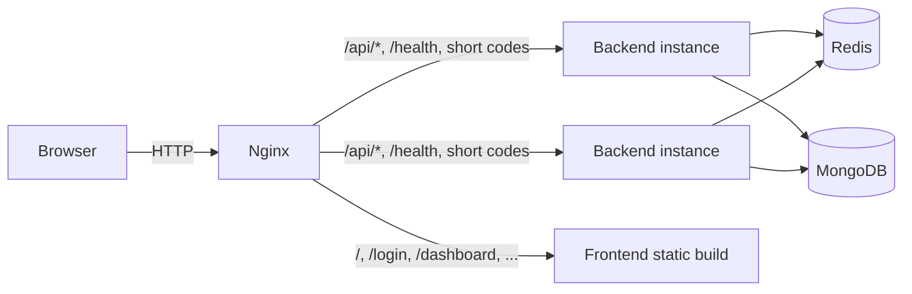
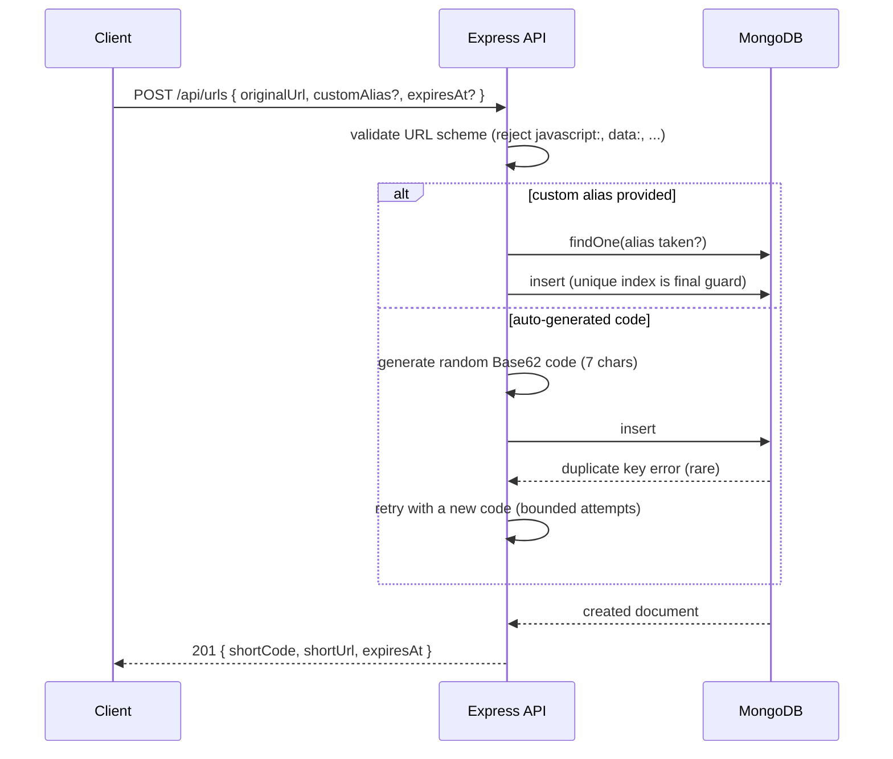
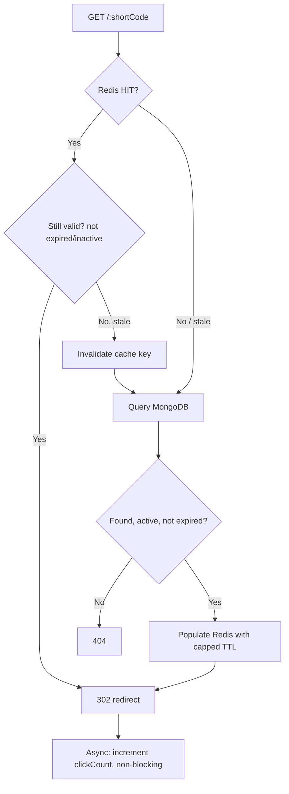

# Snapr - URL Shortener

A production-oriented URL shortener built as a portfolio / interview
project: React + Nginx + Express + Redis + MongoDB, with real Redis
caching (cache-aside), Redis-backed rate limiting, JWT auth, click
analytics, link expiration, and a k6-based performance testing harness.

This is intentionally a **modular monolith** - no Kafka, no Kubernetes,
no microservices. The goal is a system that is genuinely useful to
operate and easy to explain end-to-end in an interview.

## 1. Features

- Email/password auth (JWT, bcrypt-hashed passwords)
- Shorten a URL with an auto-generated code or a custom alias
- Optional expiration (1h / 24h / 7d / 30d / custom)
- Fast redirects via a Redis cache-aside layer, MongoDB as source of truth
- Redis-backed rate limiting (correct across multiple backend replicas)
- Click tracking (count + last-clicked time) per link
- Dashboard with aggregate stats and a per-link analytics view
- Centralized error handling, structured JSON logging, `/health` endpoint
- Dockerized: `docker compose up --build` runs the whole stack
- Stateless backend that can be horizontally scaled behind Nginx
- k6 performance scripts for redirect throughput, cache hit rate, URL
  creation, rate limiting, and horizontal scaling

## 2. Tech Stack

| Layer | Technology | Why |
|---|---|---|
| Frontend | React + Vite + TypeScript + Tailwind + React Router + Axios | Fast dev loop, typed, small bundle |
| Backend | Node.js + Express + TypeScript | Ubiquitous, easy to explain, huge ecosystem |
| Database | MongoDB (Mongoose) | Flexible schema for URL metadata, native TTL indexes |
| Cache | Redis (ioredis) | Sub-millisecond reads for the hot redirect path |
| Reverse proxy | Nginx | Single entry point, routes to frontend/backend, enables horizontal scaling |
| Validation | Zod | Type-safe request validation |
| Auth | JWT + bcrypt | Stateless auth, no server-side session store needed |
| Performance testing | k6 | Scriptable load testing with built-in percentile metrics |

## 3. Architecture



Nginx uses Docker's embedded DNS resolver to route to the `backend`
service name at request time, so `docker compose up --scale backend=4`
gets real round-robin traffic across replicas with no Nginx reload.

### Why these choices

- **Why MongoDB?** URL metadata (aliases, expirations, click stats) is
  document-shaped and doesn't need multi-table joins. Native TTL indexes
  give free background cleanup of expired links.
- **Why Redis?** The redirect path is read-heavy and latency-sensitive;
  Redis serves cache hits in sub-millisecond time versus a MongoDB round
  trip, and doubles as a correct, shared rate-limit store across replicas.
- **Why cache-aside (not write-through)?** Writes (creating/updating a
  URL) are rare compared to reads (redirects). Cache-aside keeps writes
  simple - the cache is only populated lazily, on first read - and avoids
  keeping Redis in the write path for every mutation.
- **Why Redis for rate limiting specifically?** An in-memory counter is
  per-process; with multiple backend replicas behind Nginx, each instance
  would enforce its own separate limit, effectively multiplying the real
  limit by the replica count. Redis gives one shared counter.
- **Why a stateless backend?** No sticky sessions, no local state to
  replicate - any request can go to any replica, which is what makes
  horizontal scaling behind Nginx trivial.
- **Why index `shortCode`?** It's the lookup key for every redirect - the
  single most frequent read in the system. A unique index also gives us
  collision protection for free (see below).

## 4. URL Creation Flow



### Short-code generation, in detail

We use **secure-random Base62** codes (`nanoid` with a 62-character
alphabet), 7 characters long - not a sequential counter encoded to
Base62.

- A counter would need a centralized, coordinated sequence (a Mongo
  counter document or a Redis `INCR`) shared by every stateless replica -
  extra infrastructure and a single point of contention for every write.
- Random codes need no coordination between replicas.
- 62^7 ≈ 3.5 trillion possible codes, so collisions are rare, and are
  **never** relied upon "check existence, then insert" - that has a race
  condition (two requests can both see "not taken" and then both insert).
  Instead we attempt the insert directly; MongoDB's **unique index on
  `shortCode`** is the actual, final authority. If the insert fails with
  a duplicate-key error (`code === 11000`), we generate a new code and
  retry (bounded to 5 attempts, see `services/shortCode.service.ts`).
- The same pattern applies to custom aliases: we check for a friendlier
  error message first, but the unique index is still what actually
  prevents two concurrent requests from claiming the same alias.

## 5. Redirect Flow (Cache-Aside)



Key points:

- **MongoDB is always the source of truth.** A cache hit is only trusted
  after re-checking its own embedded `expiresAt`/`isActive` fields - no
  network round trip needed for that check, since the cached payload
  carries what's needed.
- **MongoDB's TTL index is a housekeeping mechanism, not a correctness
  guarantee.** TTL deletion runs on a background sweep roughly every 60
  seconds, so a document can still exist in Mongo for a short window
  after its `expiresAt` has passed. The redirect handler independently
  checks `expiresAt` before ever responding with a 302, so an expired
  link never redirects even if MongoDB hasn't swept it yet.
- **Redis TTL never exceeds the URL's own expiration** - it's calculated
  as `min(secondsUntilExpiry, 24h safety ceiling)`, so a cached "valid"
  entry can never outlive the real expiration (`services/cache.service.ts`).
- **If Redis is down**, `isRedisAvailable()` returns false, every cache
  read/write is skipped, and the app falls straight through to MongoDB.
  The process does not crash and redirects keep working (slower, but
  correct) - see `config/redis.ts`.
- **Click tracking never blocks the redirect.** `recordClick()` is fired
  without `await`-ing it in the response path; failures are logged, never
  surfaced to the user. See "Future improvements" for how this becomes
  fully asynchronous.

## 6. Redis Caching details

Cache key: `url:<shortCode>`. Cached value (`CachedUrl`):

```json
{ "originalUrl": "https://example.com", "expiresAt": "2026-10-01T00:00:00.000Z", "isActive": true }
```

Only two counters are tracked: `redis_cache_hits` and
`redis_cache_misses` (in-memory, per process - see `getCacheStats()` in
`services/cache.service.ts`). Hit rate:

```
hitRate = hits / (hits + misses) * 100
```

Exposed at `GET /health` under `data.cache`.

## 7. Rate Limiting

Redis-backed fixed-window counters (`INCR` + `EXPIRE` on first hit),
implemented in `services/rateLimiter.service.ts`. Because the counter
lives in Redis rather than each process's memory, the limit is enforced
correctly no matter how many backend replicas are running behind Nginx.

| Route | Default limit |
|---|---|
| `POST /api/auth/register` | 5 / min / IP |
| `POST /api/auth/login` | 5 / min / IP |
| `POST /api/urls` | 10 / min / IP |
| `GET /:shortCode` | 100 / min / IP |

All configurable via `RATE_LIMIT_*` environment variables. Exceeding the
limit returns `429`. If Redis is unavailable, the limiter **fails open**
(logs a warning, allows the request) rather than taking down the API -
rate limiting is a protective feature, not the source of truth.

## 8. Link Expiration

Supported: `1h`, `24h`, `7d`, `30d`, or a custom ISO date string (see
`resolveExpiration()` in `validators/url.validator.ts`). Enforcement is
layered:

1. The redirect handler always checks `expiresAt` itself (source of truth).
2. A MongoDB TTL index (`expireAfterSeconds: 0` on `expiresAt`) cleans up
   expired documents in the background so the collection doesn't grow
   unbounded - but this is housekeeping, not correctness.
3. Redis TTL is capped to the URL's own expiration so a cached entry
   can't outlive it.

## 9. Click Tracking

Tracked: `clickCount`, `createdAt`, `lastClickedAt` via a single atomic
`updateOne({ $inc: { clickCount: 1 }, $set: { lastClickedAt } })` - one
write, no read-modify-write race. Fired without blocking the redirect
response.

**Future improvement - moving this to an async pipeline:** at higher
scale, even a fire-and-forget MongoDB write on every redirect adds load
to the primary database. A natural next step is to have the redirect
handler publish a lightweight "click" event (short code, timestamp,
optionally referrer/user-agent) to a queue - Redis Streams is the
simplest option that wouldn't add a new piece of infrastructure - and
have a separate worker process batch-consume events and update MongoDB
(or a purpose-built analytics store) on its own schedule. This decouples
"serve the redirect fast" from "record the analytics" - exactly the kind
of change that becomes necessary once click volume is high enough for
the write itself to matter, not before.

## 10. Database Schema

**User**

| Field | Type | Notes |
|---|---|---|
| `_id` | ObjectId | |
| `name` | String | |
| `email` | String | unique, indexed, lowercased |
| `passwordHash` | String | `select: false`, stripped from `toJSON` |
| `createdAt` | Date | |

**ShortUrl**

| Field | Type | Notes |
|---|---|---|
| `_id` | ObjectId | |
| `userId` | ObjectId | indexed (ref User) |
| `originalUrl` | String | |
| `shortCode` | String | **unique index** |
| `customAlias` | String \| null | |
| `expiresAt` | Date \| null | indexed; TTL index (`expireAfterSeconds: 0`) |
| `clickCount` | Number | default 0 |
| `createdAt` | Date | |
| `lastClickedAt` | Date \| null | |
| `isActive` | Boolean | default true |

## 11. API Documentation

Base path in production (behind Nginx): `http://localhost`. All request
bodies are JSON. Authenticated routes require `Authorization: Bearer <token>`.

### Auth

| Method | Path | Auth | Body | Notes |
|---|---|---|---|---|
| POST | `/api/auth/register` | No | `{ name, email, password }` | 201, rate-limited 5/min/IP |
| POST | `/api/auth/login` | No | `{ email, password }` | 200, returns `{ user, token }`, rate-limited 5/min/IP |
| POST | `/api/auth/logout` | Yes | - | 200 (stateless JWT - client discards token) |
| GET | `/api/auth/me` | Yes | - | 200, current user |

### URLs

| Method | Path | Auth | Body | Notes |
|---|---|---|---|---|
| POST | `/api/urls` | Yes | `{ originalUrl, customAlias?, expiresAt? }` | 201, rate-limited 10/min/IP |
| GET | `/api/urls` | Yes | - | 200, all URLs owned by the caller |
| GET | `/api/urls/:id` | Yes | - | 200 or 404 |
| PATCH | `/api/urls/:id` | Yes | `{ originalUrl?, expiresAt?, isActive? }` | 200, invalidates cache |
| DELETE | `/api/urls/:id` | Yes | - | 204, invalidates cache |
| GET | `/api/urls/:id/analytics` | Yes | - | 200, `{ totalClicks, lastClickedAt, ... }` |

### Redirect & Health

| Method | Path | Auth | Notes |
|---|---|---|---|
| GET | `/:shortCode` | No | 302 redirect, 404 if missing/expired, rate-limited 100/min/IP |
| GET | `/health` | No | 200/503, `{ status, mongo, redis, cache }` |

### Response shape

Success: `{ "success": true, "data": ... }`
Error: `{ "success": false, "error": { "code": "...", "message": "..." } }`

Status codes used: `200, 201, 204, 400, 401, 403, 404, 409, 429, 500`.

## 12. Failure Handling

| Failure | Behavior |
|---|---|
| Redis down | Cache reads/writes skipped, rate limiter fails open, app keeps serving via MongoDB (logged, non-fatal) |
| MongoDB down | `/health` reports `503`/`down`; requests needing Mongo will error with a `500`, but the process doesn't crash |
| A backend replica dies | Nginx (via Docker's embedded DNS) simply stops routing to it; other replicas keep serving - no shared state to lose since the backend is stateless |
| Invalid/expired JWT | `401` with a clear error code, never a stack trace |
| Duplicate short code / alias / email | `409 Conflict`, resolved via bounded retry (codes) or a clear error (aliases/emails) |
| Unsafe URL scheme (`javascript:`, `data:`, ...) | Rejected at creation time with `400`, before ever touching the database |
| Unhandled error | Centralized handler returns `500` with a generic message; stack traces are never sent in production (`NODE_ENV=production`) |

## 13. Design Trade-offs

- **Fixed-window rate limiting** is simple to explain and implement but
  allows short bursts right at window boundaries; a sliding-window log or
  token bucket would smooth that out at the cost of more Redis operations
  per request. Fixed-window was chosen as the right complexity level for
  this project.
- **In-memory cache hit/miss counters** are per-process, so with multiple
  backend replicas, `/health` on any given instance only reflects that
  instance's own traffic. A cluster-wide view would move the counters
  into Redis (`INCR redis_cache_hits` / `redis_cache_misses`) - a small,
  clearly-scoped change if it's ever needed.
- **Synchronous click tracking** (a non-blocking Mongo write per
  redirect) is simple and correct at moderate scale, but is the first
  thing to move to an async pipeline (see Section 9) if click volume
  becomes the bottleneck.
- **Nginx routing by URL-path convention** (reserved words like
  `/login`, `/dashboard` belong to the frontend; everything else at the
  root is treated as a short code) is simple for local development, but
  means those specific words can never be issued as short codes - the
  backend enforces this too (`RESERVED_ALIASES` in `url.service.ts`).
  Production URL shorteners usually sidestep this entirely by putting
  short links on a separate domain (e.g. `bit.ly` vs `bitly.com`).

## 14. Future Improvements

- Async click-event pipeline (Section 9)
- Cluster-wide cache stats via Redis counters instead of per-process memory
- Sliding-window or token-bucket rate limiting
- Refresh tokens / JWT blocklist for real logout invalidation
- QR code generation per short URL
- Custom domains per user
- Bulk URL import
- Admin dashboard / global analytics

## 15. Local Development

See `LOCAL_SETUP.md` for the complete Windows/PowerShell setup guide
(prerequisites, environment variables, Docker commands, manual testing
checklist, troubleshooting, and the daily command cheat sheet).

## 16. Performance Testing

See `performance/README.md` for exact k6 commands and
`performance/results/report.md` for results. **This project was built in
a sandboxed environment without Docker or k6 available**, so the
benchmark tables currently say `NOT YET MEASURED` - the backend's own
Jest/Supertest suite (37 tests, mocked Mongo/Redis) was run and passes,
but real load-test numbers need to be generated on your machine with the
real stack running. Never use placeholder numbers for resume claims -
only numbers you've actually measured.

## 17. Project Structure

```
url-shortener/
├── client/           React + Vite + TS + Tailwind frontend
├── server/           Express + TS backend (controllers/services/models/...)
├── nginx/            Reverse proxy config
├── performance/      k6 scripts + results
├── docker-compose.yml
├── .env.example
└── README.md
```
